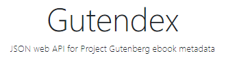
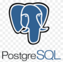

# BIENVENID@ TU LIBRERIA ONLINE  

# Aplicación de Gestión de Libros

## Descripción

En este proyecto se desarrollo una aplicación de gestión bibliotecaria que facilita la interacción con la API de consumo Gutendex, permitiendo la búsqueda y almacenamiento de libros.

Además, proporciona herramientas para la gestión eficiente de información relacionada con autores y libros, todo ello respaldado por un Sistema de gestión de bases de datos relacional mediante almacenamiento local.
## Tecnologías Utilizadas

- **Sistema Operativo:** Windows 10 
- **Entorno de Desarrollo Integrado (IDE):** Intellij IDEA ver. 241.15989.150 
- **JDK de Java:** 17.0.11 
- **Framework:** Spring Framework 
- **Gestor de Dependencias :** Maven 
- **API de Cosumo:** Gutendex-API 
- **Gestor de bases de datos :** PostgreSQL 

## Características Principales

- **Base de Datos**: Utiliza PostgreSQL para almacenar libros y autores.

- **API Externa**: Interacción con Gutendex API para buscar detalles de libros almacenados en el servidor y almacenar el libro con solo buscar una parte del nombre.

- **Interfaz de Usuario Interactiva**: Implementa un menú interactivo para que los usuarios seleccionen diversas operaciones.

- **Gestión de Dependencias**: Maven se utiliza para gestionar las dependencias del proyecto y facilitar la construcción y administración del ciclo de vida del proyecto.

- **Testing**: Se incluyen pruebas unitarias con Spring Boot Test para verificar la funcionalidad del código.

## Características Implementadas

1. **Agregar libro por nombre**
    - Busca un libro por su nombre en la API de Gutendex y lo almacena en la base de datos local si no está presente.

2. **Mostrar libros buscados**
    - Muestra todos los libros almacenados localmente.

3. **Buscar libros almacenados por nombre**
    - Permite buscar un libro específico por su título en la base de datos local.

4. **Buscar todos los autores de libros buscados**
    - Muestra todos los autores asociados a los libros almacenados localmente.

5. **Buscar un autor en específico por nombre**
    - Permite buscar un autor específico por su nombre en la base de datos local.

6. **Buscar autores por año**
    - Busca autores vivos en un año específico, utilizando datos de cumpleaños y fecha de fallecimiento si están disponibles.

7. **Buscar libros por idioma**
    - Permite buscar libros almacenados localmente por su idioma.

8. **Top 10 libros más descargados**
    - Muestra los 10 libros más descargados de la base de datos local, ordenados por cantidad de descargas.

## Autor

Este proyecto fue desarrollado por [Felipe Villalobos Montañez].